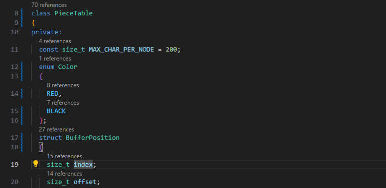

# CPP Codelens

The CPP Codelens extension enhances your coding experience by providing inline reference counts and easy navigation for your C++ projects, helping you quickly see how many times and where a particular symbol is referenced within your workspace.

## ✨ Key Features

-   🔍 Reference Count CodeLens: Displays the number of references for various C++ symbols directly above their declarations.
-   ⚙️ Highly Configurable: Enable or disable CodeLens per symbol type (e.g., classes, methods, fields, functions, etc.)
-   🔗 Seamless Integration: Works smoothly with popular C++ tools and VS Code’s C++ extensions
-   🧠 Supports Common C++ Symbol Types: Tracks functions, methods, variables, and other common C++ symbols for comprehensive insight.
-   🔄 Real-Time Updates: Automatically refreshes CodeLens as you write, keeping information up-to-date without manual reloads.

## Requirements

-   ✅ Proper IntelliSense setup

    Make sure the C++ language server is initialized and working (Without this, reference counts may not show or will show as 0).

## Extension Settings

|                      Settings                       |                                                                              Description                                                                               |         Default          |
| :-------------------------------------------------: | :--------------------------------------------------------------------------------------------------------------------------------------------------------------------: | :----------------------: |
|            `cpp-codelens.enableCodeLens`            |                                                                     Enable/disable this extension                                                                      |          `true`          |
|  `cpp-codelens.codelens.references.emptyTemplate`   | Fallback template shown above symbols when no specific template when no references are found is configured for that symbol type.Leave empty to disable the annotation. |           `""`           |
| `cpp-codelens.codelens.references.singularTemplate` |                     Fallback template shown above symbols with exactly one reference when no specific template is configured for that symbol type.                     | `{{ count }} references` |
|  `cpp-codelens.codelens.references.pluralTemplate`  |                      Fallback template shown above symbols with multiple references when no specific template is configured for that symbol type.                      | `{{ count }} references` |

### Individual symbol Configuration:

|                            Settings                            |                                                     Description                                                      |         Default          |
| :------------------------------------------------------------: | :------------------------------------------------------------------------------------------------------------------: | :----------------------: |
| `cpp-codelens.codelens.references.{symbolType}.enableCodeLens` |                                     Enable/disable code lens for `{symbolType}`                                      |          `true`          |
| `cpp-codelens.codelens.references.{symbolType}.emptyTemplate`  | Template text displayed above an `{symbolType}` when no references are found. Leave empty to disable the annotation. |           `""`           |
|     `cpp-codelens.codelens.{symbolType}.singularTemplate`      |                      Template text displayed above an `{symbolType}` with exactly one reference.                      | `{{ count }} references` |
|      `cpp-codelens.codelens.{symbolType}.pluralTemplate`       |                       Template text displayed above an `{interface}` with multiple references.                       | `{{ count }} references` |

## Release Notes

### 1.0.0

Initial release
